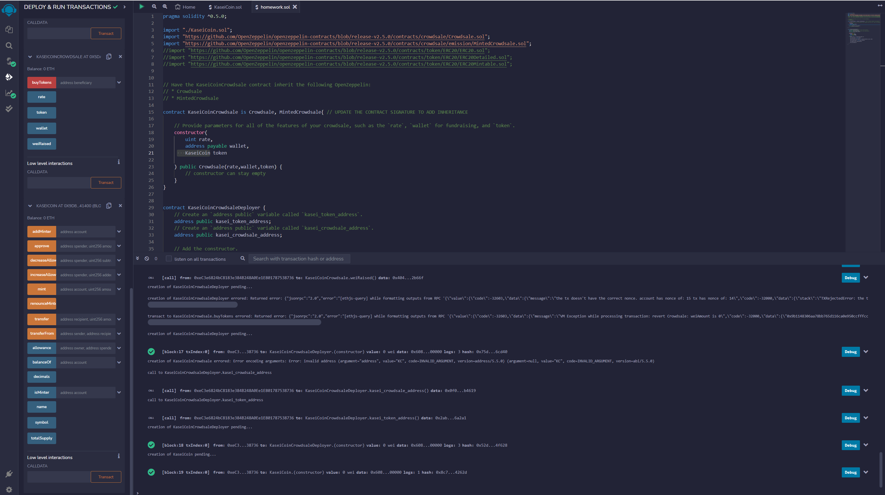
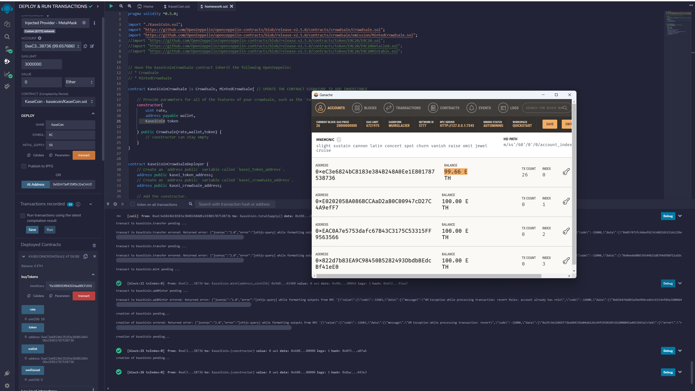
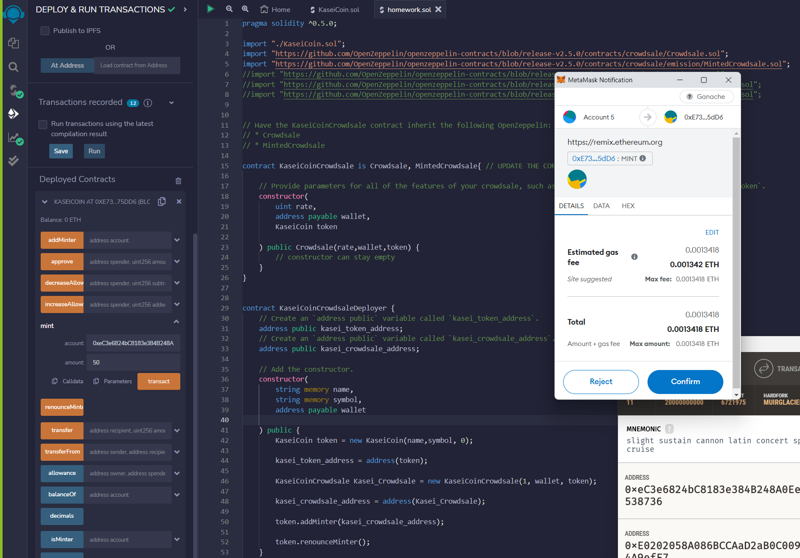
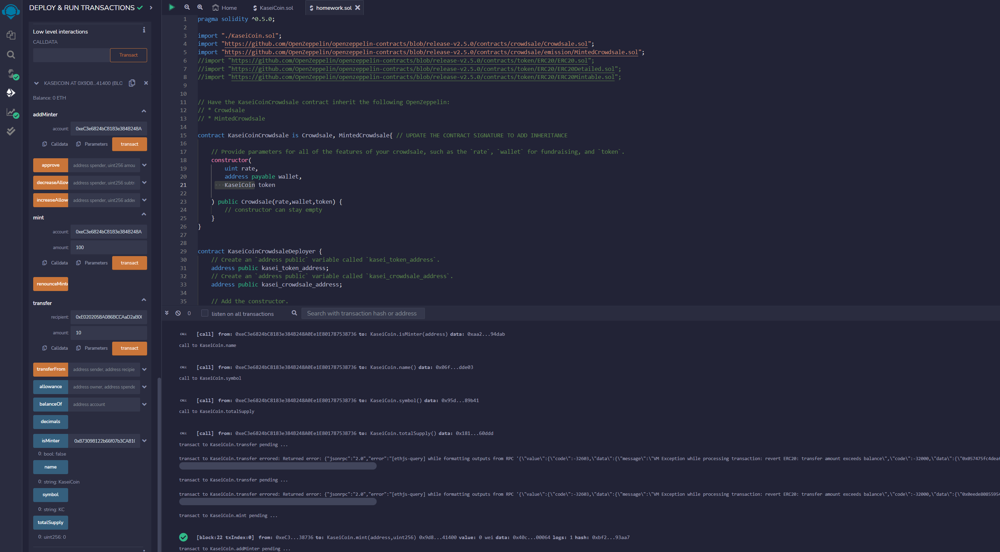
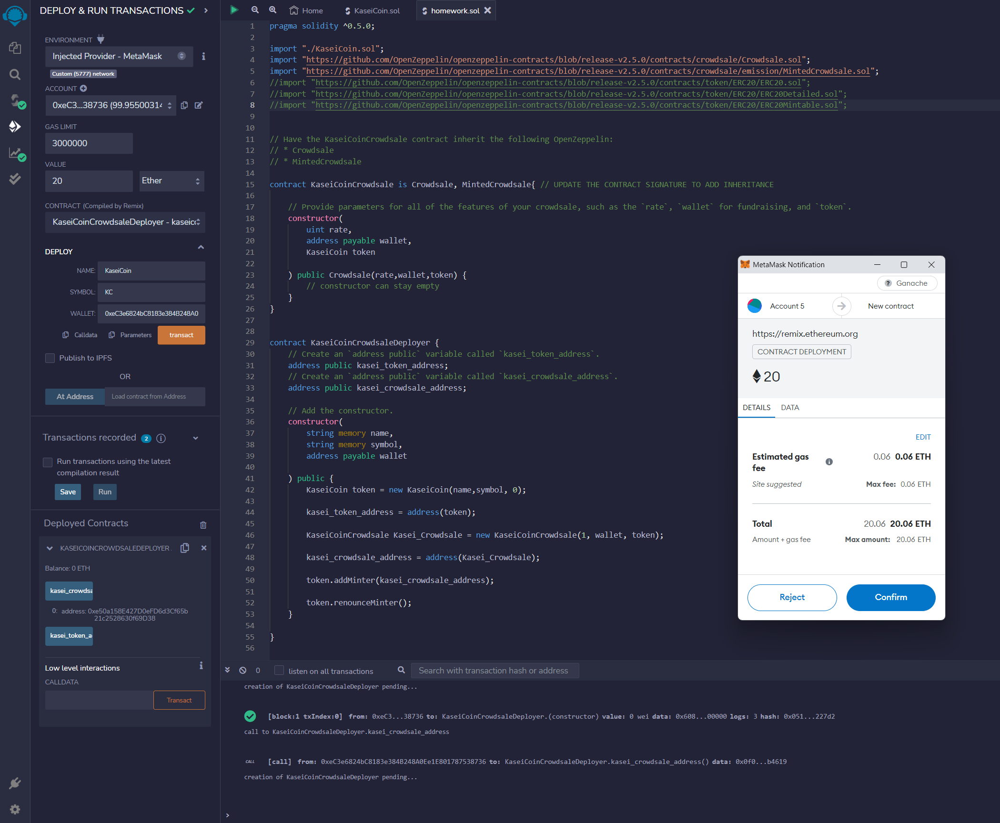
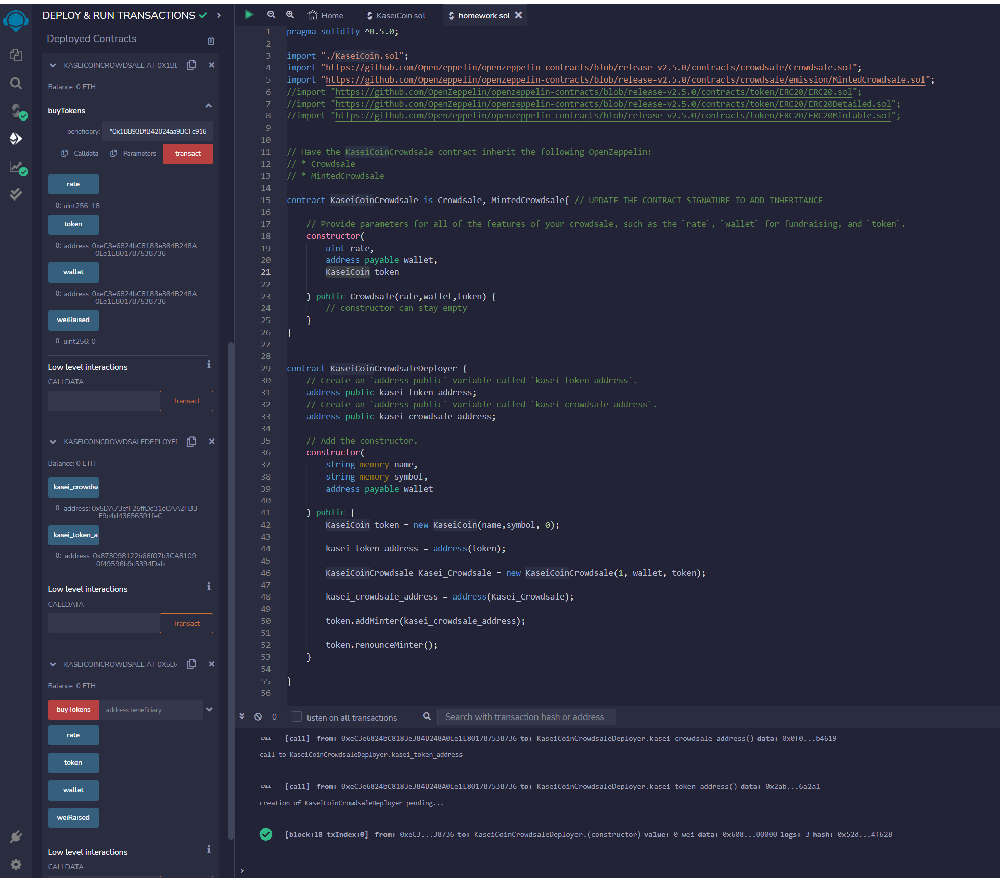
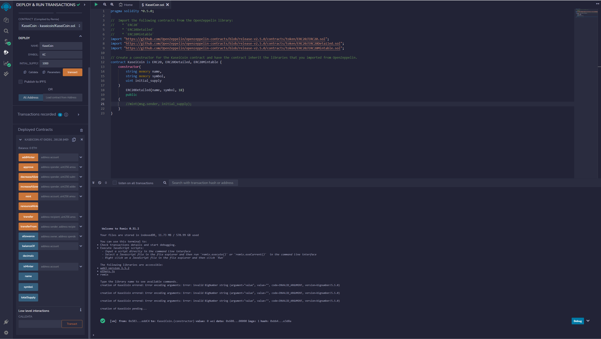

# Unit 21: Martian Token Crowdsale

## Background

This is blockchain technology challenge, I defined a new cryptocurrency named **KaseiCoin**. (Kasei means Mars in Japanese.)

KaseiCoin will be a fungible token that’s ERC-20 compliant. I’ll launch a crowdsale that will allow people who are moving to Mars to convert their earthling money to KaseiCoin.

## Files

[KaseiCoin.sol](./Starter_Code/KaseiCoin.sol)

[KaseiCoinCrowdsale.sol](./Starter_Code/KaseiCoinCrowdsale.com)

## Instructions

The steps are divided into the following subsections:

1. Create the KaseiCoin Token Contract

2. Create the KaseiCoin Crowdsale Contract

3. Create the KaseiCoin Deployer Contract

4. Deploy and Test the Crowdsale on a Local Blockchain

5. Extend the Crowdsale Contract by Using OpenZeppelin

I’ll create a fungible token that’s ERC-20 compliant. This token will be minted by using a `Crowdsale` contract from the OpenZeppelin Solidity library.

The crowdsale contract that I create will manage the entire crowdsale process. This process will allow users to send `Ether` to the contract and receive KaseiCoin tokens, or **KAI**, in return. My contract will automatically mint the tokens and distribute them to a buyer in one transaction.

### Step 1: Create the KaseiCoin Token Contract

I’ll create a smart contract that defines KaseiCoin as an ERC-20 token. This are the steps:

1. Import the `KaseiCoin.sol` file into the Remix IDE.

2. Import the following contracts from the OpenZeppelin library:

    * `ERC20`

    * `ERC20Detailed`

    * `ERC20Mintable`

3. Define a contract for the KaseiCoin token, and name it `KaseiCoin`. Have the contract inherit the three contracts that I imported from OpenZeppelin.

4. Inside `KaseiCoin` contract, add a constructor

5. As part of the constructor definition, add a call to the constructor of the `ERC20Detailed` contract, passing the parameters `name`, `symbol`, and `18`.

6. Compile the contract by using compiler version 0.5.0.

### Step 2: Create the KaseiCoin Crowdsale Contract

In this subsection, I’ll define the KaseiCoin crowdsale contract. To do so, I completed the following steps:

1. Import the `KaseiCoinCrowdsale.sol` into the Remix IDE.

2. Have this contract inherit the following OpenZeppelin contracts:

    * `Crowdsale`

    * `MintedCrowdsale`

3. In the `KaisenCoinCrowdsale` constructor, provide parameters for all the features of the crowdsale, such as `rate`, `wallet` (where to deposit the funds that the token raises), and `token`. 

4. used Compiler version 0.5.0.

### Step 3: Create the KaseiCoin Deployer Contract

In this subsection, I’ll create the KaseiCoin deployer contract.

Next, in the `KaseiCoinCrowdsaleDeployer` contract, I’ll add variables to store the addresses of the `KaseiCoin` and `KaseiCoinCrowdsale` contracts, which this contract will deploy. Finally, I’ll complete the `KaseiCoinCrowdsaleDeployer` contract. To do so, I completed the following steps:

1. Create an `address public` variable named `kasei_token_address`, which will store the `KaseiCoin` address once that contract has been deployed.

2. Create an `address public` variable named `kasei_crowdsale_address`, which will store the `KaseiCoinCrowdsale` address once that contract has been deployed.

3. Add the following parameters to the constructor for the `KaseiCoinCrowdsaleDeployer` contract: `name`, `symbol`, and `wallet`.

4. Inside of the constructor body (that is, between the braces), complete the following steps:

    * Create a new instance of the `KaseiCoinToken` contract.

    * Assign the address of the KaseiCoin token contract to the `kasei_token_address` variable. (This will allow me to easily fetch the token's address later.)

    * Create a new instance of the `KaseiCoinCrowdsale` contract by using the following parameters:

      * The `rate` parameter: Set `rate` equal to 1 to maintain parity with Ether.

      * The `wallet` parameter: Pass in `wallet` from the main constructor. This is the wallet that will get paid all the Ether that the crowdsale contract raises.

      * The `token` parameter: Make this the `token` variable where `KaseiCoin` is stored.

    * Assign the address of the KaseiCoin crowdsale contract to the `kasei_crowdsale_address` variable. (This will allow to easily fetch the crowdsale’s address later.)

    * Set the `KaseiCoinCrowdsale` contract as a minter.

    * Have the `KaseiCoinCrowdsaleDeployer` renounce its minter role.

5. Compile the contract by using compiler version 0.5.0.

### Step 4: Deploy and Test the Crowdsale on a Local Blockchain

In this subsection, you’ll deploy the crowdsale to a local blockchain. You’ll then perform a real-world, preproduction test of your crowdsale. To do so, complete the following steps:

you can find screenshot of the following steps: 

1. Deploy the crowdsale to a local blockchain by using Remix, MetaMask, and Ganache.

2. Test the functionality of the crowdsale by using test accounts to buy new tokens and then checking the balances of those accounts.

3. Review the total supply of minted tokens and the amount of wei that the crowdsale contract has raised.

### Extend the Crowdsale Contract by Using OpenZeppelin

In this  subsection, I extended the crowdsale contract to enhance its functionality. To do so, I’ll use the following OpenZeppelin contracts:

* The `CappedCrowdsale` contract: Allows to cap the total amount of Ether that crowdsale can raise.

* The `TimedCrowdsale` contract: Allows to set a time limit for crowdsale by adding an opening time and a closing time.

* The `RefundablePostDeliveryCrowdsale` contract: Allows to refund investors. Every time that I launch a crowdsale, I set a goal amount of ether to raise. If I don’t reach the goal, it’s a common practice to refund my investors.

>  To read more about these contracts visit [Crowdsales page](https://docs.openzeppelin.com/contracts/2.x/crowdsales) of the OpenZeppelin documentation.

### Evaluation Evidence

